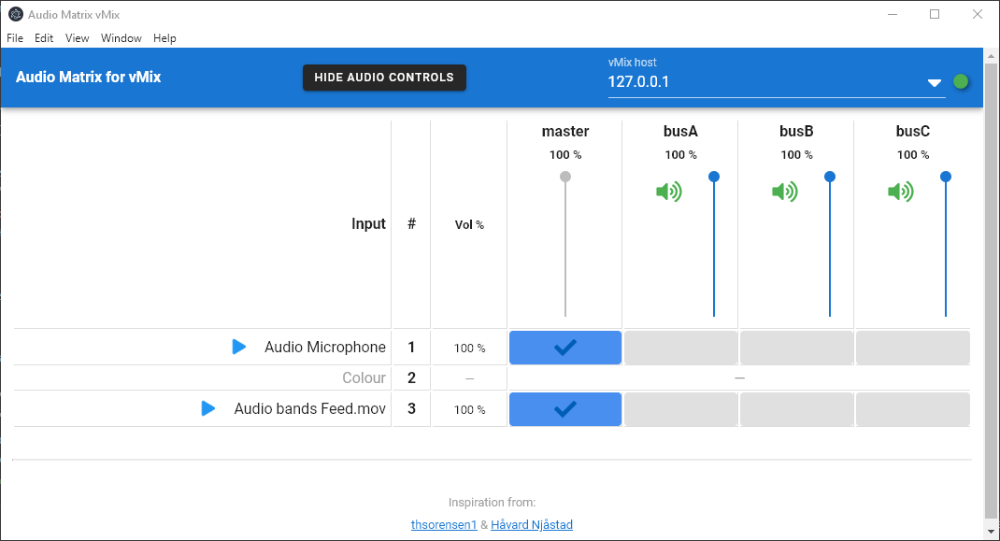

# audio-matrix-vmix-electron

[](../../releases)
[](../../releases)
[](https://paypal.me/stigaard)

Audio Matrix for vMix is a simple app that connects to a vMix instance and presents a audio matrix including audio controls.
The app is built on [ElectronJS](https://electronjs.org) which is a cross-platform framework enabling the app to be compiled to Windows, Mac and Linux.

The app is oriented for touch use. It suits very well on a Microsoft Surface Pro PC or similar.



-----

## Downloads

### Latest version (1.0.0)
[For MacOS](../../releases/download/v1.0.0/Audio.Matrix.vMix.Electron-1.0.0.dmg)

[For Windows](../../releases/download/v1.0.0/Audio.Matrix.vMix.Electron.Setup.1.0.0.exe)

Additionally see the [**Releases**](../../releases) tab for current and older released versions of the app.

## Features
### Intuitive interface
Clean and intuitive interface with the primarily use case for toggling audiobusses on/off for inputs

### vMix host entering
In the app bar you can easily change the vMix host or IP address.
It includes a dropdown menu with recently used hosts, so you can easily swap between hosts.

### Audio controls
Simple audio controls for volume and mute/unmute for
* audio busses A-G
* inputs with audio

Use the shortcut `Cmd+Alt+A` (or the action in the app menu) to toggle visibility of the audio controls.
In some cases it is convenient that the interface is as simple as possible, and only with the audio matrix, without many disturbing controls.

### Hide inputs without audio
Use the shortcut `Cmd+Alt+I` (or the action in the app menu) to toggle visibility of vMix inputs without audio channels.
This enables even simpler interface in case needed.

### Custom bus labels
Give each audio bus a custom label name to enable more convenience in controlling the audio busses and inputs of your production.

### Fixed header
The fixed header ensures faster operation even with many inputs in the vMix setup.

## Feature requests
Do you have a good idea for an additional feature for this app? Post a [new Issue](../../issues/new) or write me an email at <jens@stigaard.info>.

## FOSS
This repo is Free and Open Source Software based on MIT licensing.
You are free to clone the repository to develop your own app based in this code.

## Related projects
If you are interesting in similar apps you can check out the following repos:

* [Simple vMix switcher electron app](https://github.com/jensstigaard/simple-vmix-switcher-electron).

## Known issues
**Input with phantom audio channels**
 Inputs without audio channels will appear in the interface by default, but any action using the audio controls will be ignored, since the input has no audio channels. This bug was found by Dave Edwards. Thanks for the tip. It is an issue with the vMix API itself, and it is reported to vMix, which hopefully will fix it in an upcoming vMix update.

## Inspiration from
This project was inspired by
 * [vMatrix Audio Routing by thsorensen1](https://forums.vmix.com/posts/t21233-vMatrix-audio-routing)
 * [vMix Audio Matrix by Håvard Njåstad](https://github.com/Haavard15/vMixAudioMatrix)

## Contributors
[See list of contributors for this repo](../../graphs/contributors)

## Project setup
### Install dependencies
```
yarn install
```

### Compiles and hot-reloads for development
```
yarn electron:serve
```

### Compiles and minifies for production
```
yarn electron:build
```

### Lints and fixes files
```
yarn lint
```

### Customize configuration
See [Configuration Reference](https://cli.vuejs.org/config/).
