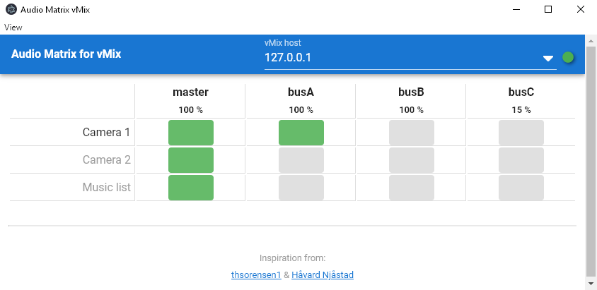

# audio-matrix-vmix-electron

Simple Audio Matrix vMix app built with [ElectronJS](https://electronjs.org). ElectronJS is a cross-platform framework allowing the app to be built for each Windows, Mac or Linux. 

The app is oriented for touch use.



You are free to clone the repository to develop your own app based in this code.

## Downloads

See the [**Releases**](./releases) tab for a direct download of the app.


## Project setup
### Install dependencies
```
yarn install
```

### Compiles and hot-reloads for development
```
yarn electron:serve
```

### Compiles and minifies for production
```
yarn electron:build
```

### Lints and fixes files
```
yarn lint
```

### Customize configuration
See [Configuration Reference](https://cli.vuejs.org/config/).
